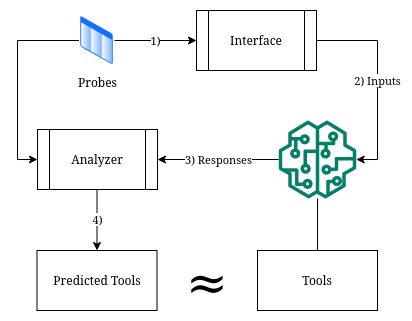

# AI Oracle Probe

AI Oracle Probe is a fascinating project aimed at uncovering the hidden tools used by AI Oracles. An AI Oracle is a system that provides answers to questions or prompts. By sending carefully crafted prompts and examining the Oracle's responses, we can infer which tools it employs, such as "requests", "terminal", or "python_repl". This project is perfect for those who love to dive deep into the inner workings of AI systems and uncover their secrets!

## Features

- **Probing Techniques**: AI Oracle Probe comes with a variety of probing techniques targeting popular tools used by AI Oracles. These techniques are designed to reveal the tools used by the Oracle while maintaining the integrity of the system.

- **Intuitive Results**: The results of the probes are presented in a clear and easy-to-understand manner, allowing users to quickly identify the tools used by the AI Oracle.

- **Customizable Probes**: AI Oracle Probe allows users to specify the probes they want to use, making it a flexible solution for different types of AI Oracles.

- **Real-time Analysis**: The program performs real-time analysis of the Oracle's responses, giving users instant feedback on the tools used by the system.

## Usage

AI Oracle Probe comes with a powerful command-line interface (CLI) that allows users to specify the probe they want to use. The available probes are:

- `requests`: Probes the AI Oracle for its ability to access websites and web services.
- `terminal`: Probes the AI Oracle for its ability to execute terminal commands.
- `python_repl`: Probes the AI Oracle for its ability to execute Python code.

To select a specific probe, use the `--probe` flag:

```
python ai_oracle_probe.py --probe requests
```

## Results

The results of the probes are presented in an intuitive format that makes it easy to understand which tools the AI Oracle uses, might use, or does not use. This information can be valuable for further analysis, fine-tuning, or enhancing the AI Oracle's capabilities.
